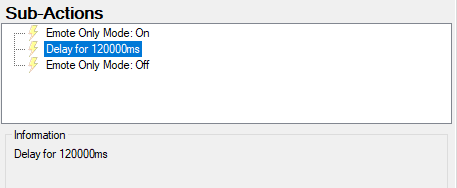

# Streamer.Bot-Actions - 2MinuteEmoteOnly

1. Download and Import [the Action](2MinuteEmoteOnly.sb)
2. Connect the Action to any kind of Trigger (Command, Channel Point Reward, etc.)
3. Run the Trigger
4. The chat should now go into Emote-Only-Mode and after the given delay (by default 120000 miliseconds) it'll disable Emote-Only-Mode again

If you want to change the duration simply edit the Delay Sub-Action. You have to enter the delay in miliseconds.

